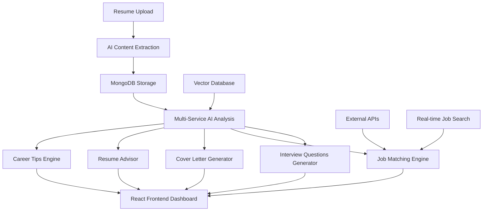

# AI-Powered Resume Assistant

[](https://python.org)
[](https://fastapi.tiangolo.com/)
[](https://reactjs.org/)
[](https://langchain.com)
[](https://ai.google.dev/)
[](https://mongodb.com)

> **Intelligent resume analysis platform that leverages advanced AI to provide comprehensive career assistance including interview preparation, job matching, cover letter generation, and personalized career advice.**

## 🎯 Platform Overview

This AI-powered resume assistant combines multiple intelligent services to provide comprehensive career support:

- **Resume Analysis & Processing** with advanced PDF extraction and content parsing
- **AI-Generated Interview Questions** tailored to your specific background and experience
- **Job Matching & Discovery** with real-time job search integration
- **Cover Letter Generation** personalized for specific job descriptions
- **Resume Enhancement Advice** with actionable improvement suggestions
- **Career Tips & Guidance** based on industry trends and best practices
- **Real-Time Job Market Intelligence** with latest IT industry news and opportunities



## 🚀 Core AI Capabilities

### Intelligent Resume Processing
- **Advanced PDF Extraction**: Multi-format document processing with content preservation
- **Structured Data Parsing**: Automated extraction of skills, experience, education, and contact information
- **Content Normalization**: Standardized formatting for consistent AI analysis
- **Vector Embeddings**: Semantic understanding of resume content for enhanced matching

### AI-Powered Interview Preparation
- **Dynamic Question Generation**: Role-specific interview questions based on your experience
- **Multi-Source Research**: Integration with search APIs for comprehensive question coverage
- **Relevance Verification**: AI validation of question appropriateness and difficulty level
- **Adaptive Learning**: Question refinement based on industry trends and feedback

### Intelligent Job Matching
- **Semantic Job Analysis**: Deep understanding of job descriptions and requirements
- **Skills Gap Identification**: Precise matching between your profile and job requirements
- **Compatibility Scoring**: Quantified assessment of job fit and application success probability
- **Market Intelligence**: Real-time job market data and opportunity discovery

### Personalized Content Generation
- **Context-Aware Cover Letters**: Tailored applications highlighting relevant experience
- **Resume Enhancement Suggestions**: Data-driven improvement recommendations
- **Career Progression Tips**: Personalized advice based on your career trajectory
- **Industry Insights**: Current market trends and skill demand analysis

### Real-Time Career Intelligence
- **Live Job Feeds**: Integration with major job platforms and search engines
- **Industry News Monitoring**: Latest developments in technology and career markets
- **Skill Demand Tracking**: Emerging technologies and in-demand competencies
- **Salary Intelligence**: Market rate analysis and compensation insights

## 🛠️ Technology Architecture

| Component | Technology | Purpose |
|-----------|------------|---------|
| **Backend Framework** | FastAPI | High-performance API development with automatic documentation |
| **AI Engine** | Google Gemini 1.5 Flash | Advanced language model for content generation and analysis |
| **AI Orchestration** | LangChain | Tool integration and prompt engineering framework |
| **Database** | MongoDB | Document storage for resume data and user profiles |
| **Vector Store** | Pinecone | Semantic search and content similarity matching |
| **Search Integration** | SerpAPI | Real-time job search and market intelligence |
| **Frontend** | React + Tailwind CSS | Modern, responsive user interface |
| **Containerization** | Docker | Consistent deployment and development environments |
| **File Processing** | PyPDF + Python-multipart | Document parsing and upload handling |

## 🔧 Installation & Setup

### Prerequisites

```bash
# System Requirements
Python 3.11+
Node.js 16+ (for frontend)
MongoDB Database
Pinecone Account
Google AI Studio API Key
SerpAPI Account
Docker (optional)
```

### Backend Configuration

Create a `.env` file with your API credentials:

```env
# Google AI Configuration
GOOGLE_API_KEY=your_gemini_api_key

# Database Configuration
MONGODB_URL=mongodb://localhost:27017/resume_assistant
MONGODB_DATABASE=resume_assistant

# Vector Database
PINECONE_API_KEY=your_pinecone_api_key
PINECONE_ENVIRONMENT=your_pinecone_environment

# Search Integration
SERPAPI_KEY=your_serpapi_key

# Application Settings
DEBUG=True
HOST=0.0.0.0
PORT=8000
```

### Dependencies Installation

#### Backend Setup
```bash
# Clone repository
git clone <repository-url>
cd ai-resume-assistant

# Create virtual environment
python -m venv venv
source venv/bin/activate  # On Windows: venv\Scripts\activate

# Install Python dependencies
pip install -r requirements.txt

# Start MongoDB service
mongod --dbpath /path/to/your/db

# Run FastAPI application
uvicorn main:app --host 0.0.0.0 --port 8000 --reload
```

#### Frontend Setup
```bash
# Navigate to frontend directory
cd frontend

# Install Node.js dependencies
npm install

# Start development server
npm start

# Build for production
npm run build
```

### Docker Deployment

```bash
# Build and run with Docker
docker build -t resume-assistant .
docker run -p 8000:8000 resume-assistant

# Or use Docker Compose (if available)
docker-compose up --build
```

## 🚀 Usage Guide

### Core Features Walkthrough

#### 1. Resume Upload & Processing
- **Upload Support**: PDF, DOC, DOCX formats
- **Content Extraction**: Automated parsing of personal information, skills, experience, and education
- **Data Validation**: AI-powered verification of extracted information accuracy
- **Structured Storage**: Organized data storage in MongoDB for quick retrieval

#### 2. AI Interview Question Generation
- **Personalized Questions**: Role-specific questions based on your background
- **Difficulty Scaling**: Questions adjusted to your experience level
- **Research Integration**: Enhanced questions using real-time web search
- **Export Capabilities**: Download questions for offline preparation

#### 3. Job Matching & Analysis
- **Compatibility Assessment**: Detailed analysis of job fit based on skills and experience
- **Gap Analysis**: Identification of missing skills and qualifications
- **Application Strategy**: Recommendations for improving application success
- **Market Positioning**: Understanding of your competitive advantage

#### 4. Cover Letter Generation
- **Job-Specific Customization**: Tailored content for each application
- **Experience Highlighting**: Strategic emphasis on relevant background
- **Professional Tone**: Industry-appropriate language and formatting
- **Multiple Versions**: Generate variations for different applications

#### 5. Resume Enhancement
- **Content Optimization**: Suggestions for improving resume impact
- **Keyword Enhancement**: Industry-relevant term recommendations
- **Structure Improvements**: Layout and formatting suggestions
- **ATS Compatibility**: Optimization for applicant tracking systems

#### 6. Career Intelligence
- **Real-Time Job Search**: Live job opportunities matching your profile
- **Industry News**: Latest developments in your field
- **Skill Trends**: Emerging technologies and competencies in demand
- **Salary Intelligence**: Market rate information and negotiation insights

### API Integration Examples

#### Resume Processing Workflow
The system processes uploaded resumes through multiple AI-powered stages, extracting structured information and storing it for analysis across all features.

#### Job Search Integration
Real-time job search leverages SerpAPI to provide current opportunities, while AI analysis matches these positions to user profiles for relevance scoring.

#### Content Generation Pipeline
All generated content (questions, cover letters, advice) uses consistent AI prompting with user-specific context for personalized, relevant output.

## 🔍 AI Model Configuration

### Language Model Setup
The system uses Google Gemini 1.5 Flash for high-performance content generation, configured with JSON output formatting for structured responses and consistent API integration.

### Prompt Engineering
Specialized prompt templates ensure consistent, high-quality outputs across all features, with role-specific instructions and output formatting requirements.

### Search Enhancement
Integration with search APIs provides real-time information augmentation, improving question quality and job market intelligence accuracy.

## 📈 Performance & Scalability

### Processing Metrics
- **Resume Processing**: 2-5 seconds per document
- **Question Generation**: 3-8 seconds for complete sets
- **Job Matching**: 1-3 seconds per job description
- **Content Generation**: 2-6 seconds per output

### Scalability Considerations
- **Database Optimization**: Indexed queries for fast data retrieval
- **API Rate Limiting**: Efficient use of external service quotas
- **Caching Strategy**: Reduced redundant AI model calls
- **Async Processing**: Non-blocking operations for improved user experience

### Resource Utilization
- **Memory Usage**: 512MB-2GB depending on document size
- **API Calls**: Optimized to minimize external service costs
- **Storage Requirements**: Efficient document and metadata storage
- **Bandwidth**: Optimized for responsive user interactions

## 🛡️ Security & Privacy

### Data Protection
- **Local Processing**: Resume content processed locally when possible
- **Secure Storage**: Encrypted database storage for sensitive information
- **API Security**: Secure handling of external API keys and credentials
- **User Privacy**: No permanent storage of personal information without consent

### Access Control
- **Environment Variables**: Secure configuration management
- **API Key Management**: Protected credential storage and rotation
- **Input Validation**: Comprehensive sanitization of user inputs
- **Error Handling**: Secure error messages without information leakage

## 🔧 Troubleshooting

### Common Issues

#### API Connection Problems
- Verify API keys are correctly set in environment variables
- Check network connectivity for external service access
- Confirm API quotas and billing status for paid services
- Test individual API endpoints for service availability

#### Database Connection Issues
- Ensure MongoDB service is running and accessible
- Verify connection string format and credentials
- Check network permissions and firewall settings
- Confirm database exists and has proper permissions

#### File Processing Errors
- Verify uploaded file format compatibility
- Check file size limits and processing timeouts
- Ensure sufficient disk space for temporary files
- Validate PDF structure and content accessibility

#### Frontend Integration Problems
- Confirm backend API is running and accessible
- Check CORS configuration for cross-origin requests
- Verify API endpoint URLs match backend routes
- Test individual API calls using browser developer tools

## 🚀 Advanced Configuration

### Custom AI Prompts
The system supports customization of AI prompts for different industries, experience levels, and specific use cases through the prompts configuration module.

### Database Scaling
MongoDB configuration can be optimized for larger datasets with proper indexing, sharding, and replica sets for production deployments.

### API Integration Extensions
The modular architecture supports additional API integrations for enhanced job search, salary data, and industry intelligence services.

### Frontend Customization
React component architecture allows for easy customization of user interface elements, themes, and workflow configurations.

## 📄 Development & Contribution

### Development Setup
- **Code Style**: Follow PEP 8 for Python, ESLint for JavaScript
- **Testing**: Implement unit tests for core functionality
- **Documentation**: Update README and inline comments for changes
- **Version Control**: Use meaningful commit messages and branch names

### Contribution Guidelines
- **Feature Requests**: Open issues with detailed descriptions and use cases
- **Bug Reports**: Include steps to reproduce and system information
- **Code Contributions**: Follow existing patterns and include tests
- **Documentation**: Update relevant documentation for changes

### Future Enhancements
- **Multi-language Support**: Internationalization for global users
- **Advanced Analytics**: Detailed career progression tracking and insights
- **Integration Ecosystem**: Support for additional job platforms and services
- **Mobile Application**: Native mobile apps for enhanced accessibility

---

**This AI Resume Assistant represents a comprehensive solution for modern career management, combining advanced AI capabilities with practical tools for job search success and career development.**
